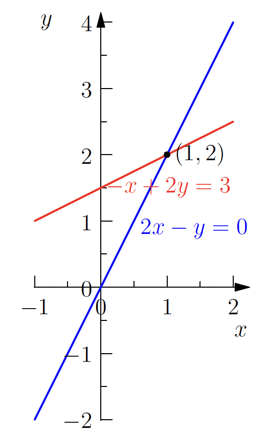
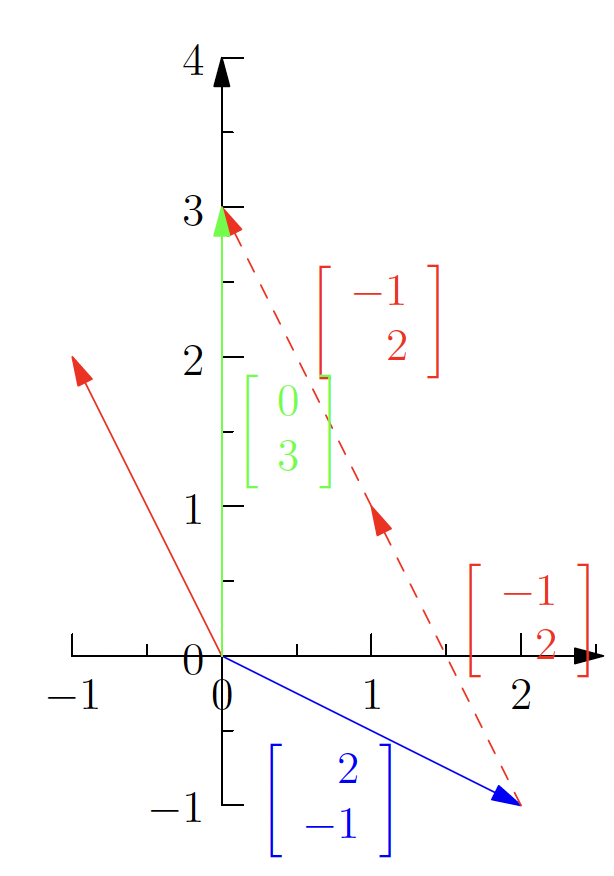

# Die Geometrie linearer Gleichungen
Das grundlegende Problem der linearen Algebra ist das Lösen von n linearen Gleichungen mit n Unbekannten; zum Beispiel:

$$ 2x - y = 0 $$
$$ -x + 2y = 3 $$

In dieser ersten Betrachtung zur linearen Algebra betrachten wir dieses Problem auf drei Arten.

## Zeilenbild (Row Picture)
Stellt man die Punkte grafisch dar, die jede Gleichung erfüllen, repräsentiert der Schnittpunkt der Graphen (sofern sie sich schneiden) die Lösung des Gleichungssystems. Betrachtet man die Abbildung, sieht man, dass die Lösung für dieses Gleichungssystem x=1, y=2 ist.

{width=200 height=300}

Wir setzen diese Lösung in das ursprüngliche Gleichungssystem ein, um unser Ergebniss zu überprüfen:

$$2 \cdot 1 - 2 = 0 $$
$$ -1 + 2 \cdot 2 = 3$$

## Spaltenbild (Column Picture)
Im Spaltenbild schreiben wir das System linearer Gleichungen als eine einzige Vektorgleichung um, indem wir die Koeffizienten in den Spalten des Systems als Vektoren betrachten:

$$x \begin{bmatrix} 2 \\ -1 \end{bmatrix} + y \begin{bmatrix} -1 \\ 2 \end{bmatrix} = \begin{bmatrix} 0 \\ 3 \end{bmatrix}$$

Gegeben zwei Vektoren $c$ und $d$ und Skalare $x$ und $y$, wird die Summe $xc + yd$ als Linearkombination von $c$ und $d$ bezeichnet. 

Geometrisch wollen wir Zahlen $x$ und $y$ finden, sodass $x$ mal des Vektors $\begin{bmatrix} 2 \\ -1 \end{bmatrix}$ addiert zu $y$ mal des Vektors $\begin{bmatrix} -1 \\ 2 \end{bmatrix}$ gleich dem Vektor $\begin{bmatrix} 0 \\ 3 \end{bmatrix}$ entspricht. Wir können sehen, dass wir für $y=2$ und $x=1$ eine Linearkombination der beiden Vektoren finden, die den Zielvektor ergibt. 

{width=200 height=300}

## Matrixbild (Matrix Picture)
Wir schreiben das Gleichungssystem

$$ 2x - y = 0 $$
$$ -x + 2y = 3 $$

als eine einzige Gleichung unter Verwendung von Matrizen und Vektoren:

$$ \begin{bmatrix} 2 & -1 \\ -1 & 2 \end{bmatrix} \begin{bmatrix} x \\ y \end{bmatrix} = \begin{bmatrix} 0 \\ 3 \end{bmatrix} $$

Die Matrix $A = \begin{bmatrix} 2 & -1 \\ -1 & 2 \end{bmatrix}$ wird als Koeffizientenmatrix bezeichnet. Der Vektor $x = \begin{bmatrix} x \\ y \end{bmatrix}$ ist der Vektor der Unbekannten. Die Werte auf der rechten Seite der Gleichungen bilden den Vektor b:

$$ Ax = b $$

Verschiedene Methoden wie wir diese Gleichungen lösen können lernen wir in der Vorlesung und in den Übungen kennen. Wichtig ist die Erkenntnis, dass wir gleichungssysteme mit Matrizen und Vektoren darstellen können was uns verschiedene Möglichkeiten zur Lösung der Gleichungen eröffnet.
